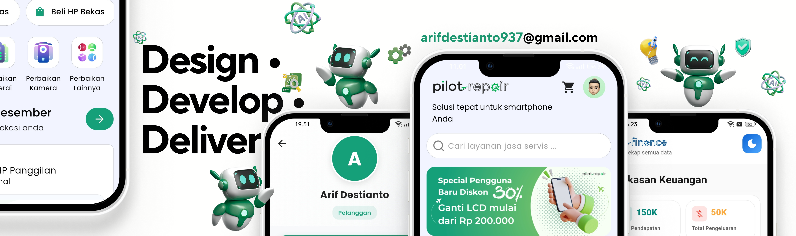

<h1 align="center">Hi 👋, Saya Arif Destianto</h1>

<h3 align="center">Full-Stack Developer | Web & Mobile Developer</h3>

  

<!-- Profile Banner -->

  

  
  
  

---

### 👨‍💻 Tentang Saya

* Lulusan **S1 Informatika**
* Fokus pada **Full-Stack Web & Mobile Development**
* Terbiasa membangun aplikasi dari **frontend hingga backend secara end-to-end**
* Memiliki pengalaman sebagai **Full-Stack Developer & Business Owner** melalui Pilot Repair
* Saat ini terus memperdalam **JavaScript, Fluter, React, Laravel, dan modern web development**
* Terbuka untuk kesempatan **kerja, internship, freelance, dan kolaborasi project**

---

### 🛠️ Tech Stack

#### Languages

### 🛠️ Tech Stack

#### Languages

<table>
  <tr>
    <td align="center" width="140">
       
      <strong>Dart</strong>
    </td>
    <td align="center" width="140">
       
      <strong>JavaScript</strong>
    </td>
    <td align="center" width="140">
       
      <strong>PHP</strong>
    </td>
  </tr>
</table>

#### Frontend & Mobile

<table>
  <tr>
    <td align="center" width="140">
       
      <strong>Flutter</strong>
    </td>
    <td align="center" width="140">
       
      <strong>React</strong>
    </td>
    <td align="center" width="140">
       
      <strong>HTML</strong>
    </td>
    <td align="center" width="140">
       
      <strong>CSS</strong>
    </td>
  </tr>
</table>

#### Backend

<table>
  <tr>
    <td align="center" width="140">
       
      <strong>Laravel</strong>
    </td>
    <td align="center" width="140">
       
      <strong>PHP</strong>
    </td>
    <td align="center" width="140">
       
      <strong>Dart Frog</strong>
    </td>
  </tr>
</table>

#### Database & Services

<table>
  <tr>
    <td align="center" width="140">
       
      <strong>PostgreSQL</strong>
    </td>
    <td align="center" width="140">
       
      <strong>MySQL</strong>
    </td>
    <td align="center" width="140">
       
      <strong>Firebase</strong>
    </td>
  </tr>
</table>

#### Tools & Platforms

<table>
  <tr>
    <td align="center" width="140">
       
      <strong>Git</strong>
    </td>
    <td align="center" width="140">
       
      <strong>GitHub</strong>
    </td>
    <td align="center" width="140">
       
      <strong>VS Code</strong>
    </td>
    <td align="center" width="140">
       
      <strong>Android Studio</strong>
    </td>
  </tr>

  <tr>
    <td align="center" width="140">
       
      <strong>Figma</strong>
    </td>
    <td align="center" width="140">
       
      <strong>Postman</strong>
    </td>
    <td align="center" width="140">
       
      <strong>Docker</strong>
    </td>
    <td align="center" width="140">
       
      <strong>Vercel</strong>
    </td>
  </tr>

  <tr>
    <td align="center" width="140">
       
      <strong>Railway</strong>
    </td>
  </tr>
</table>

---

### 🚀 Featured Projects

#### 🛒 LarisManis

Aplikasi mobile untuk membantu pengelolaan bisnis dan operasional toko.

**Tech:** Flutter · Laravel · PostgreSQL

#### ♻️ Sintera

Super App berbasis digital yang mengintegrasikan circular economy, fair food supply chain, dan pengelolaan sampah berbasis komunitas.

**Tech:** Flutter · Laravel

#### 💰 Pilot Finance

Aplikasi untuk membantu pengelolaan dan pencatatan keuangan.

**Tech:** Flutter · Dart Frog · PostgreSQL

#### 🔧 Pilot Repair

Platform dan sistem pendukung bisnis jasa servis smartphone dan jual-beli perangkat.

**Tech:** Flutter · Dart Frog · PostgreSQL

---

### 📊 GitHub Stats

  
  

---

### 🐍 Contribution Snake

  

---

### 📈 Aktivitas Terbaru

<!--START_SECTION:activity-->

<!--END_SECTION:activity-->

---

### 📫 Let's Connect

  
  

---

⭐ Thanks for visiting my GitHub profile!

